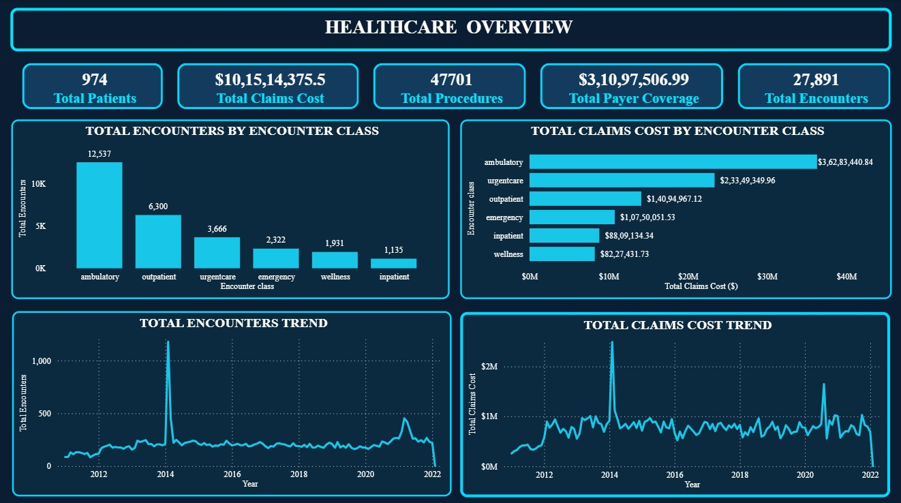

# CareScope : Hospital Patients, Services & Financial Analytics

End-to-end data analytics project analyzing hospital patients, services, and financial performance using Python, SQL, and Power BI.

---

## 📊 Power BI Dashboard Preview



---

## 🔎 Project Overview

CareScope analyzes hospital data to uncover insights into:

- 🏥 Patient activity and hospital encounters
- 👥 Patient and encounter analysis
- 🩺 Healthcare procedures and services
- 💰 Claims cost and financial performance
- 💳 Payer coverage and healthcare spending
- 📅 Encounter and claims cost trends
- 📊 Encounter-class performance
- 📈 Overall healthcare operational insights

---

## 🛠️ Tools & Technologies

🐍 Python  
🗄️ MySQL  
📊 Power BI  
📑 Excel / CSV

---

## 🔄 Project Workflow

**Raw Data → Data Cleaning → SQL Analysis → Dashboard Table → Power BI → Report**

---

## 📁 Project Structure

```text
CareScope/
│
├── 01_Raw_Data/
├── 02_Clean_Data/
├── 03_SQL_Analysis/
├── 04_Dashboard_Table/
├── 05_Power_BI/
├── 06_Report/
│
├── CARESCOPE.jpg
└── README.md
